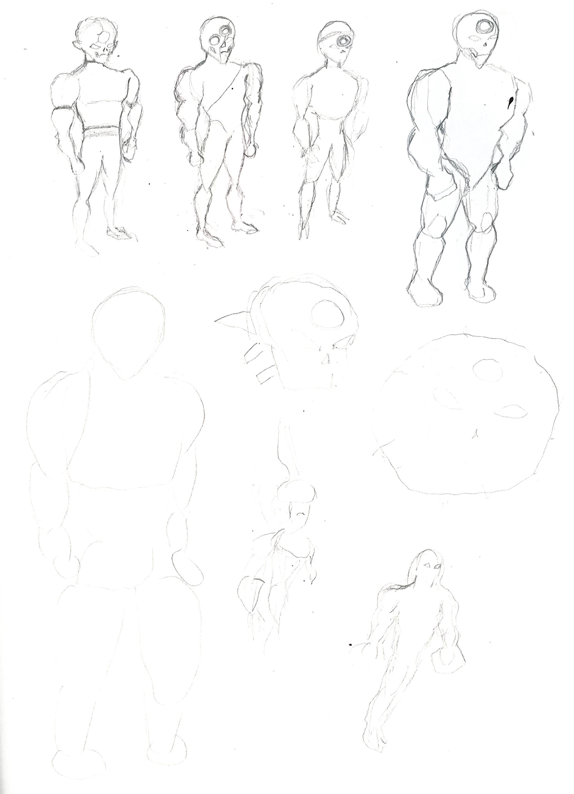
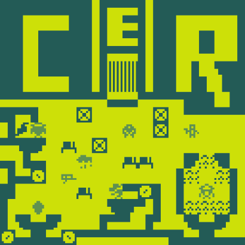
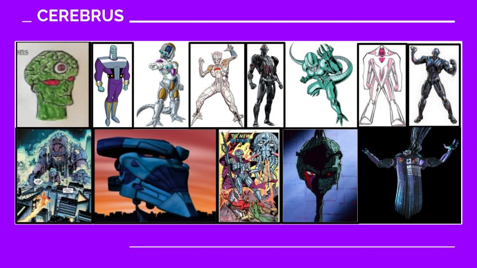
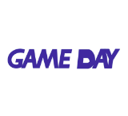
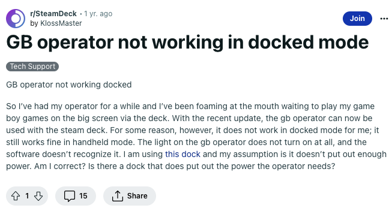
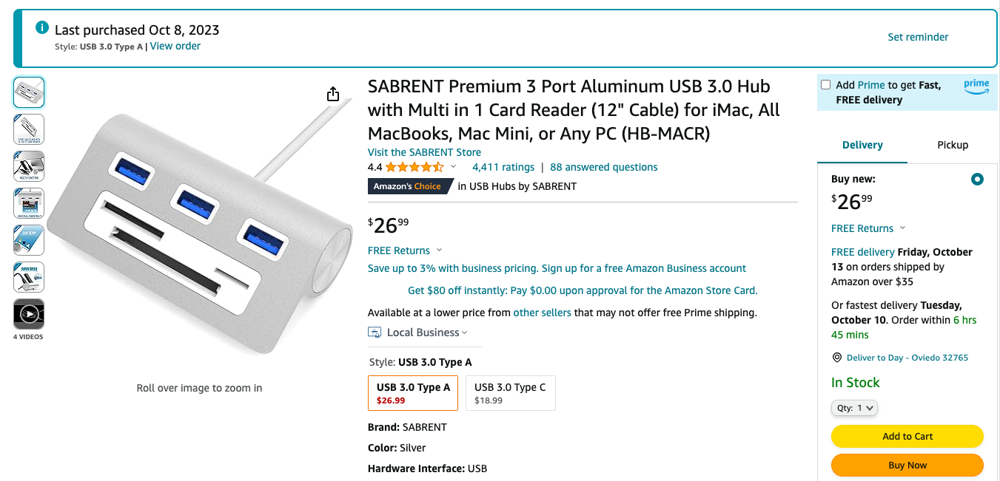
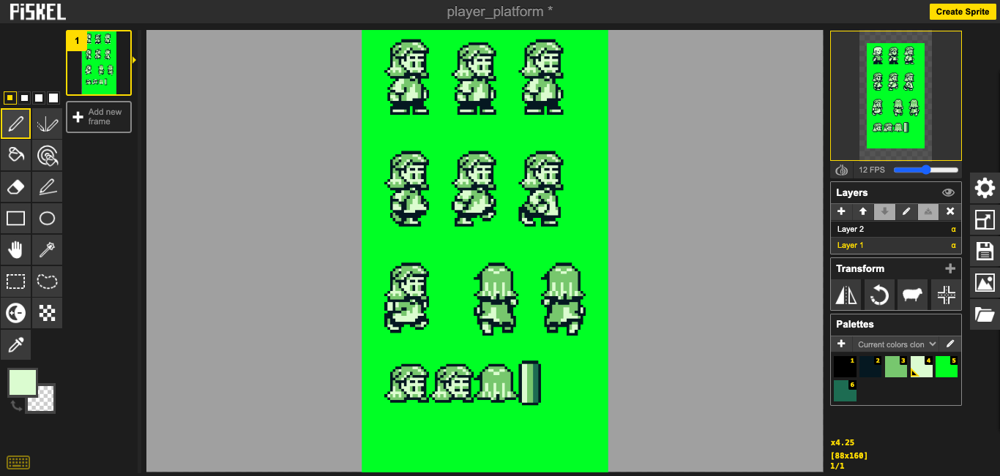
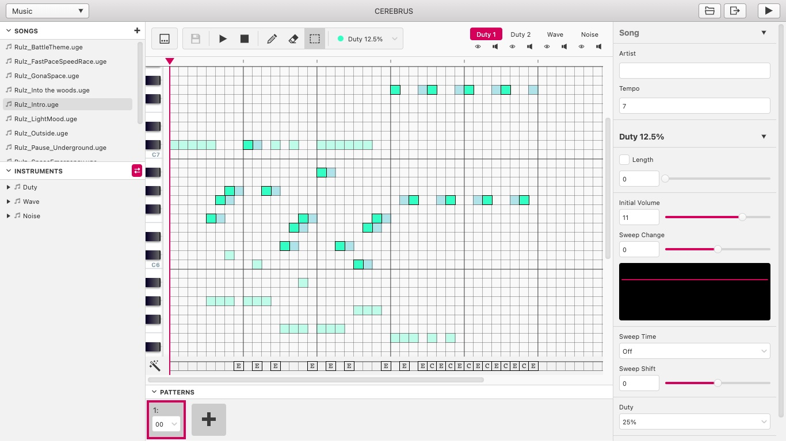

## What's This?

This page is a documentation of my Studio 1 project in the Digital Media master's program at University of Central Florida.

---

# [Interverse](https://drive.google.com/file/d/1YnNcxIfKU50CxqdNZ5-U0C_sa13jA0g2/view)

<object data="./Transmedia%20Story%20Creation%20-%20Final%20Project%20Production Bible.pdf" width="1000" height="1000" type='application/pdf'></object>

The project is intended as a continuation and another narrative component of my ambitious proposed franchise Interverse, an homage to my love for retro culture and superhero fiction. A companion piece to my Twine game in Theory & Practice of Interactive Storytelling, the project will encompass Game Boy software that places players in the role of franchise villain Cerebrus, who was previously teased in the Twine game as the protagonist's archnemesis. The game will revisit areas and events previously depicted in the Twine game from a fresh new perspective through the villain's eyes and the unique pixelated medium of Game Boy.

# Concept Art

I have drawn out some concept art for my player character and his potential forms in his evolution as he gains power over the course of the narrative. 

I also made a visualization through Bitsy of the game's potential starting point, a research lab where Cerebrus will awaken and break free from captivity. 

# [GB Studio](https://drive.google.com/file/d/1ZMuxbRlH6gTmaL4mSbie3MBdfMNNQezg/view)

<iframe src="https://drive.google.com/file/d/1ZMuxbRlH6gTmaL4mSbie3MBdfMNNQezg/preview" width="1000" height="562.5" allow="fullscreen"></iframe>

I have begun experimenting with GB Studio and recorded a quick test run of the software's tutorial project. The playthrough has given me ideas on how to consolidate the aesthetics of my creative vision with the game's mechanics.

# Exhibition Setup

.jpg)

Preparation has also begun for the physical exhibition that will showcase my project. I ultimately plan on connecting a Game Boy ROM cartridge to modern hardware like the Steam Deck through the GB Operator cartridge reader accessory, so that the game can also be played on a big screen for a unique perspective on experienceing the Game Boy. I have run into some obstacles, however, as the Docking Station I use to mount my Steam Deck can be fickle when connecting to HDMI. Also, while the Deck itself can read the Operator when connected directly to the accessory, it will not read the device while docked, potentially undermining the big screen experience I intend to realize. I am looking into solutions such as alternate docks or intermediary hubs that will address this issue.

.jpg)

Meanwhile, the Operator had no issue when connected to personal computers as long as they had the device's corresponding emulation software installed.

---

I look forward to observing how my project will evolve as it continues to grow, develop, and change in response to a wide array of dynamic creative factors.

---

# Concept Art II

I drew inspiration for the design of Cerebrus' different evolutionary stages from various media including comic books, anime, and Saturday morning cartoons.

I continued and completed the concept art for my player character and his potential stages of evolution.

After completing the preliminary sketches, I inked them to reinforce the image.

I then colored the drawings with a vibrant palette meant to evoke comic books and retro games.

# GB Studio II

 .png)  .png)

I designed my logo and title screen through Google Slides and Canva, respectively, then pixelated them through a [free online tool](https://pinetools.com/pixelate-effect-image).

.png)
I then uploaded the new designs to replace the placeholder templates in GB Studio.

<iframe src="https://drive.google.com/file/d/16F1ermbB17oJL1l7h6TDw7gpTXaO_iL7/preview" width="1000" height="562.5" allow="fullscreen"></iframe>
I also replaced and added in-game dialogue so that it would fit the context of my project's narrative.

<iframe src="https://drive.google.com/file/d/1juAJIxDVHqTmCGeM_K-rewgepeYg-iaj/preview" width="1000" height="562.5" allow="fullscreen"></iframe>
Finishing touches to my current build also included applying a green filter to all of the scenes to match the original Game Boy's aesthetics.

# Exhibition Setup II

.png)
I found a potential solution to the connection problem between the GB Operator and the Docking Station. One particular Reddit thread featured two users who discussed finding [a USB hub](https://www.amazon.com/gp/product/B01BED52VI/ref=ppx_yo_dt_b_asin_title_o00_s00?ie=UTF8&psc=1) that acted as a missing link between the two.

Upon finding the device online, I ordered through Amazon.

.png)
When the package arrived, I went right away to testing the device with my personal computer. It worked!

%20-%20Setup.png)
%20-%20Setup%20(Back).jpg)
With bated breath, I then moved on to the Steam Deck, connecting the GB Operator to the USB hub, which in turn plugged into the Docking Station. Here goes nothing...

.png)
%20-%20Title%20Screen.png)
%20-%20Gameplay.png)
Success! I was ecstatic about this huge step forward in my exhibition design, and now I only needed the worry about the actual game itself.

---

Until next time, stay tuned for further updates!

---

# GB Studio III - Sprites

For my spritework, I decided to settle for the first form of my character from the concept art in the initial stages of the game.

 .jpg) .jpg) .jpg)
Deriving from this design, I finally got around to making the spritesheets for my player character. To maintain consistent movement and animation, I drew frames over placeholder template sprites provided by GB Studio.

<iframe src="https://https://drive.google.com/file/d/1L5Stjj7a5Zb77e37IeHPk2uOGkZMe17Q/preview" width="1000" height="562.5" allow="fullscreen"></iframe>
Afterwards, I successfully implemented the new player character design into the game across the different areas.

# GB Studio III - Music

 .jpg)
I was relieved to find that GB Studio came with its own music editor in the form of a piano roll, as I initially worried about producing through an external digital audio workstation and properly importing into the game. I went to work right away reworking the preexisting tracks in the template project, starting with the title screen. I made the track more minimalistic with a foreboding, sinister undertone to match my character's villainous nature.

.jpg) .jpg)
In keeping with the darker supervillain theme, I also reworked the overarching world's music to subtly create a sense of discomfort with lower and more discordant tones.

# Exhibition Setup III

<iframe src="https://drive.google.com/file/d/1tKLs3a_Fz0EaXsyf27-nmUtwUAUoWpqQ/preview" width="1000" height="562.5" allow="fullscreen"></iframe>
I exported a playable ROM of the game's demo to check its compatibility with mGBA, the core emulator program of the GB Operator. Thankfully, the homebrew ran successfully for the most part, even though there were slight bugs here and there in regards to certain renderings and collisions.

.jpg) .jpg)
Now onto one of the most crucial parts of the project: the actual physical medium through which I would present my work. I went online exploring forums dedicated to Game Boy homebrew and emulation. I found that several users had trouble finding flashcarts compatible with the GB Operator, although a general consensus seemed to lean towards Geek Tech's brand.

I plan on ordering these flashcarts while consulting my advisors to ensure the proper materials and procedures for uploading the ROM to a playable physical cartridge.

---

As always, to be continued...

---
