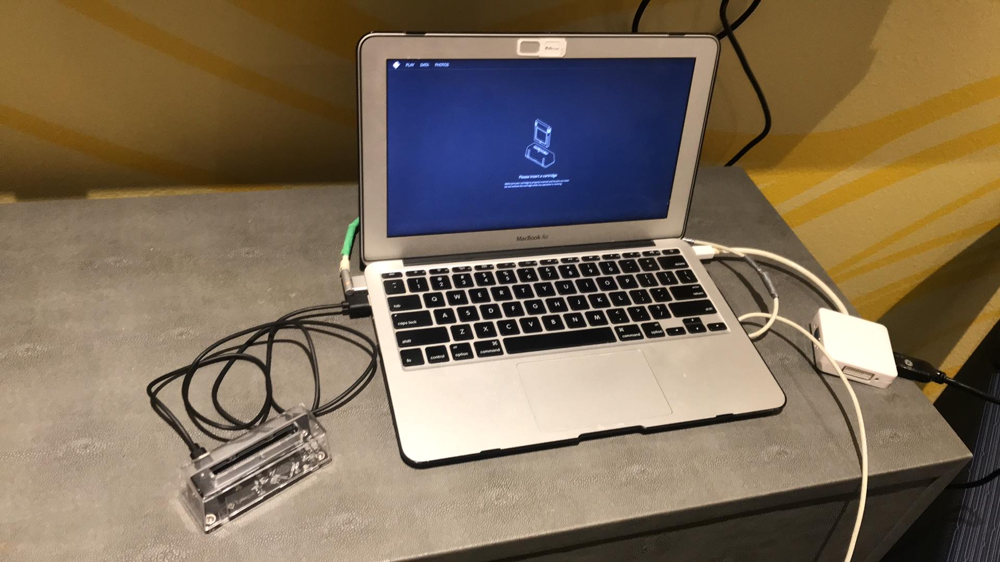

## What's This?

This page is a documentation of my Studio 1 project in the Digital Media master's program at University of Central Florida.

---

# [Interverse](https://drive.google.com/file/d/1YnNcxIfKU50CxqdNZ5-U0C_sa13jA0g2/view)

<object data="./Transmedia%20Story%20Creation%20-%20Final%20Project%20Production Bible.pdf" width="1000" height="1000" type='application/pdf'></object>

The project is intended as a continuation and another narrative component of my ambitious proposed franchise Interverse, an homage to my love for retro culture and superhero fiction. A companion piece to my Twine game in Theory & Practice of Interactive Storytelling, the project will encompass Game Boy software that places players in the role of franchise villain Cerebrus, who was previously teased in the Twine game as the protagonist's archnemesis. The game will revisit areas and events previously depicted in the Twine game from a fresh new perspective through the villain's eyes and the unique pixelated medium of Game Boy.

# Concept Art

I have drawn out some concept art for my player character and his potential forms in his evolution as he gains power over the course of the narrative. 

I also made a visualization through Bitsy of the game's potential starting point, a research lab where Cerebrus will awaken and break free from captivity. 

# [GB Studio](https://drive.google.com/file/d/1ZMuxbRlH6gTmaL4mSbie3MBdfMNNQezg/view)

<iframe src="https://drive.google.com/file/d/1ZMuxbRlH6gTmaL4mSbie3MBdfMNNQezg/preview" width="1000" height="562.5" allow="fullscreen"></iframe>

I have begun experimenting with GB Studio and recorded a quick test run of the software's tutorial project. The playthrough has given me ideas on how to consolidate the aesthetics of my creative vision with the game's mechanics.

# Exhibition Setup

.jpg)

Preparation has also begun for the physical exhibition that will showcase my project. I ultimately plan on connecting a Game Boy ROM cartridge to modern hardware like the Steam Deck through the GB Operator cartridge reader accessory, so that the game can also be played on a big screen for a unique perspective on experienceing the Game Boy. I have run into some obstacles, however, as the Docking Station I use to mount my Steam Deck can be fickle when connecting to HDMI. Also, while the Deck itself can read the Operator when connected directly to the accessory, it will not read the device while docked, potentially undermining the big screen experience I intend to realize. I am looking into solutions such as alternate docks or intermediary hubs that will address this issue.

.jpg)

Meanwhile, the Operator had no issue when connected to personal computers as long as they had the device's corresponding emulation software installed.

---

I look forward to observing how my project will evolve as it continues to grow, develop, and change in response to a wide array of dynamic creative factors.

# Concept Art II

I continued and completed the concept art for my player character and his potential stages of evolution.

After completing the preliminary sketches, I inked them to reinforce the image.

I then colored the drawings with a vibrant palette meant to evoke comic books and retro games.